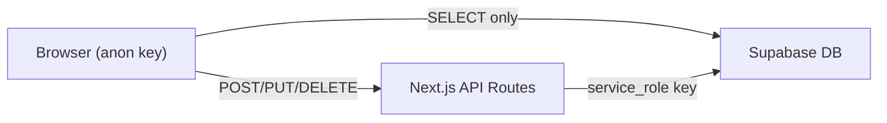

# Security Hardening: Supabase RLS & API Proxy

## Goal
Resolve the 15+ security warnings from Supabase Security Advisor by restricting public write access to the database. Currently, all tables have fully permissive RLS policies (`USING (true)`) that allow anyone with the `anon` key to read, insert, update, and delete data.

## Strategy: Server-Side Write Proxy

**Approach**: Move all write operations (INSERT, UPDATE, DELETE) behind Next.js API routes that use the `service_role` key. Keep client-side reads (SELECT) via `anon` key with read-only RLS.

> [!IMPORTANT]
> The user needs to add `SUPABASE_SERVICE_ROLE_KEY` to `.env.local`. This key is found in the Supabase Dashboard → Settings → API → `service_role` key (secret).

## Proposed Changes

### Phase 1: Server Infrastructure

#### [NEW] [supabaseAdmin.ts](file:///i:/prueba_youtube/crm_electoral/src/lib/supabaseAdmin.ts)
- Server-only Supabase client using `service_role` key
- Used exclusively in API routes (never exposed to browser)

#### [NEW] API Route: `/api/db/write`
A **single generic API route** that proxies all write operations. Accepts:
- `table`: target table name
- `operation`: `insert` | `update` | `delete` | `upsert`
- `data`: the payload
- `match`: filter conditions (for update/delete)

This avoids creating 20+ individual API routes.

---

### Phase 2: Client Migration (13 files)

Migrate all `supabase.from(...).insert/update/delete()` calls to use `fetch('/api/db/write', ...)` instead.

| File | Tables Written | Operations |
|------|---------------|------------|
| `admin/page.tsx` | 8 tables | ~25 writes |
| `europa/page.tsx` | 3 tables | ~8 writes |
| `AffiliateModal.tsx` | 3 tables | ~6 writes |
| `NewAffiliateModal.tsx` | 2 tables | ~3 writes |
| `ImportAffiliatesModal.tsx` | 1 table | ~2 writes |
| `ChangePasswordModal.tsx` | 1 table | ~1 write |
| `CarnetGenerator.tsx` | 1 table | ~1 write |
| `login/page.tsx` | 1 table | ~2 writes |
| `datos/page.tsx` | 1 table | ~2 writes |
| `elecciones-internas/page.tsx` | 2 tables | ~3 writes |
| `historial.ts` | 1 table | ~1 write |

---

### Phase 3: RLS Lockdown

#### [NEW] [secure_rls_policies.sql](file:///i:/prueba_youtube/crm_electoral/scripts/secure_rls_policies.sql)
- Restrict all table policies to **SELECT-only** for `anon`/`public`
- Remove all permissive `INSERT`/`UPDATE`/`DELETE` policies for `anon`
- Grant full access to `service_role` (default in Supabase)
- Apply to: `afiliados`, `documentos`, `actas_electorales`, `estatutos`, `usuarios`, `elecciones_cargos`, `elecciones_candidatos`, `elecciones_padron`, `europa_presidentes_dm`, `comunicaciones`, `europa_recintos`

---

### Phase 4: Communications & Internal Fixes

#### [MODIFY] [route.ts](file:///i:/prueba_youtube/crm_electoral/src/app/api/emails/send/route.ts)
- Switch from `supabase` (anon) to `supabaseAdmin` (service_role) for inserting into `comunicaciones` table.
- This fixes the broken logging caused by RLS lockdown.

#### [MODIFY] [route.ts](file:///i:/prueba_youtube/crm_electoral/src/app/api/emails/broadcast/route.ts)
- Add database logging to `comunicaciones` table after sending mass emails.
- Ensure it uses `supabaseAdmin`.

---

### Phase 7: Dual View for Affiliates

#### [MODIFY] [page.tsx](file:///i:/prueba_youtube/crm_electoral/src/app/afiliados/page.tsx)
- Introduce `viewMode` state ('grid' | 'list').
- Implement a switch/toggle in the filter header.
- Conditionally render either the existing `<GridVew />` logic or a new `<ListView />` table.
- Ensure the row click in List View triggers the same `setSelectedAffiliate` as the Grid cards.

---

## Verification Plan

### Automated Tests
- Run `npm run build` to validate no compilation errors.
- Verify state transitions between Grid and List.

### Manual Verification
- Confirm that clicking an affiliate in **List View** opens the correct technical sheet (modal).
- Confirm that filters and pagination work correctly in both views.
